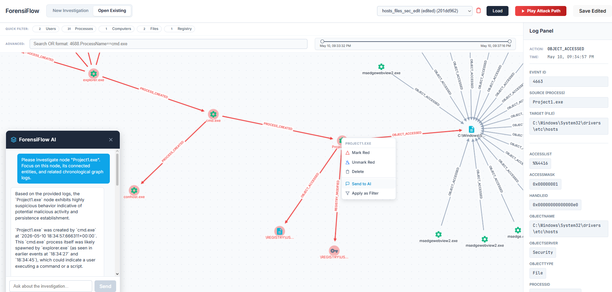

# ForensiFlow 

ForensiFlow is a powerful, interactive visual forensics tool designed to analyze Windows Event Logs (`.evtx`). By parsing raw event data and mapping the relationships into a Neo4j graph database, ForensiFlow allows cybersecurity analysts, security researchers, and incident responders to visually track Windows event logs.



## Tech Stack

* **Frontend:** React.js, React Force Graph 2D, CSS Flexbox Layouts
* **Backend:** Python 3, Flask & Flask-CORS, python-evtx, Neo4j Python Driver
* **Database:** Neo4j (Graph Database)

## Getting Started

### Prerequisites

Ensure you have the following installed on your machine:

* [Node.js](https://nodejs.org/) (v14 or higher)
* [Python](https://www.python.org/downloads/) (3.8 or higher)
* [Neo4j Desktop](https://neo4j.com/download/) or an active Neo4j AuraDB instance.

### 1. Database Setup

1. Start your Neo4j database.
2. Create a new database and set an authentication password.
3. Note your URI (e.g., `bolt://localhost:7687`), Username, and Password.

### 2. Backend Setup

1. Navigate to the backend directory.
2. Create a virtual environment using `python -m venv venv`.
3. Activate the virtual environment using `source venv/bin/activate` (On Windows use: `venv\Scripts\activate`).
4. Create a `requirements.txt` file in your backend folder with the runtime dependencies, and use `requirements-dev.txt` for test-only dependencies like `pytest` and `pytest-cov`:
   ```text
   Flask==3.0.0
   Flask-Cors==4.0.0
   python-dotenv==1.0.0
   neo4j==5.14.1
   python-evtx==0.7.4
5. Install the runtime dependencies using `pip install -r requirements.txt`.
6. If you want to run tests or coverage, also install the dev dependencies using `pip install -r requirements-dev.txt`.
7. Create a file named `.env` in the root of your backend directory to connect to your local Neo4j instance. Add the following credentials:
   ```env
   NEO4J_URI=bolt://localhost:7687
   NEO4J_USER=neo4j
   NEO4J_PASSWORD=your_secure_password
8. Run - `py server.py`

### 2. Fronted Setup

1. Run - `npm install`
2. Run - `npm run dev`
3. Go to - `http://localhost:5173/`